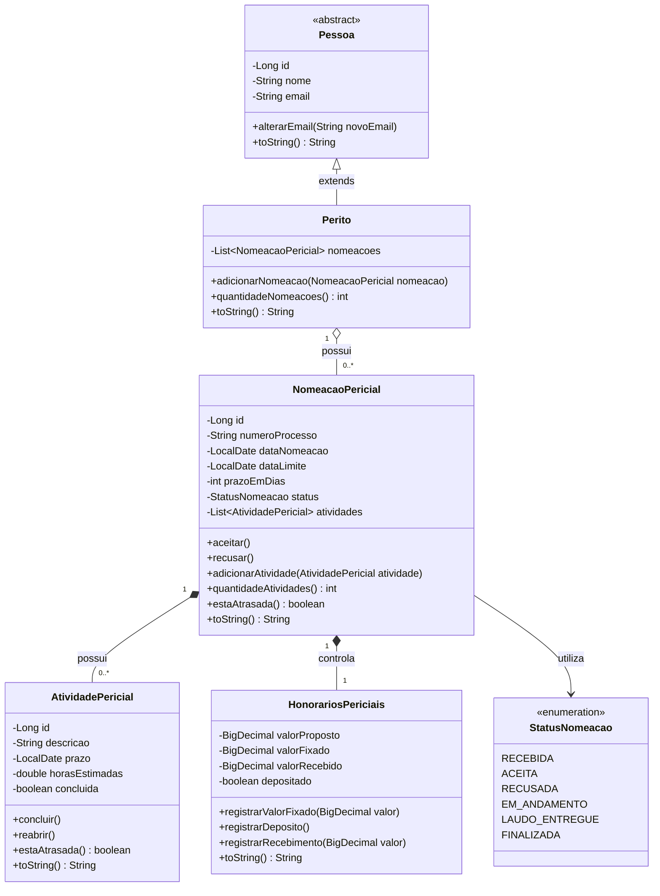

# André Gaspar API

Aplicação acadêmica desenvolvida com Java e Spring Boot para auxiliar no
controle do ciclo de vida das nomeações recebidas por peritos judiciais.

Todos os dados utilizados nesta aplicação são fictícios e destinados
exclusivamente à demonstração acadêmica.

## Etapa atual

Etapa 1 — Orientação a Objetos Avançada.

Nesta etapa, a aplicação realiza a modelagem do domínio, lê dados de
arquivos-texto, cria objetos Java, estabelece seus relacionamentos e
apresenta os resultados no console.

Ainda não existem camada de serviço, API REST, persistência com JPA ou
banco de dados. Esses recursos serão introduzidos nas etapas seguintes.

## Tecnologias

- Java 21
- Spring Boot 4.1.1
- Maven
- JUnit
- Git

## Modelo de negócio

O modelo possui as seguintes classes principais:

- `Pessoa`: classe abstrata com os dados comuns de uma pessoa;
- `Perito`: representa o perito que recebe nomeações;
- `NomeacaoPericial`: representa uma nomeação recebida em um processo;
- `AtividadePericial`: representa uma atividade vinculada à nomeação;
- `HonorariosPericiais`: representa os valores dos honorários.

Também existe o enum `StatusNomeacao`, que limita os estados possíveis
de uma nomeação pericial.

## Diagrama de classes da Etapa 1



## Herança e abstração

A classe `Pessoa` é abstrata. A classe `Perito` herda seus atributos e
comportamentos:

```java
public class Perito extends Pessoa
```

## Relacionamentos um-para-muitos

Um perito pode possuir várias nomeações:

```java
private List<NomeacaoPericial> nomeacoes;
```

Uma nomeação pode possuir várias atividades:

```java
private List<AtividadePericial> atividades;
```

Nesta etapa, os relacionamentos são representados por coleções Java em
memória. As anotações JPA serão introduzidas somente na etapa de
persistência.

## Tipos de atributos

O modelo utiliza diferentes tipos de informação:

- texto: `String`;
- número inteiro: `int`;
- número real: `double`;
- valor lógico: `boolean`;
- data: `LocalDate`;
- valor monetário: `BigDecimal`.

As classes de domínio implementam o método `toString()` para fornecer
uma representação textual dos objetos.

## Leitura dos arquivos-texto

Os dados fictícios estão armazenados em:

```text
src/main/resources/dados/peritos.txt
src/main/resources/dados/nomeacoes.txt
src/main/resources/dados/atividades.txt
```

A leitura é realizada pelas seguintes classes:

- `PeritoLoader`;
- `NomeacaoLoader`;
- `AtividadeLoader`.

Os Loaders criam os objetos e estabelecem os relacionamentos entre
peritos, nomeações e atividades.

## Inicialização e teste do modelo

A classe `InicializadorAplicacao` implementa `CommandLineRunner`.

Durante a inicialização, a aplicação:

1. lê os arquivos-texto;
2. cria os objetos;
3. associa as nomeações ao perito;
4. associa as atividades às nomeações;
5. apresenta os objetos no console;
6. exibe um resumo da carga realizada.

## Como testar

No Linux ou WSL:

```bash
./mvnw clean test
```

Resultado esperado:

```text
Tests run: 1, Failures: 0, Errors: 0
BUILD SUCCESS
```

## Como executar

Para executar como aplicação de console:

```bash
./mvnw spring-boot:run \
  -Dspring-boot.run.arguments=--spring.main.web-application-type=none
```

Resumo esperado:

```text
Peritos carregados: 1
Nomeacoes carregadas: 2
Atividades carregadas: 4
```

## Limites da Etapa 1

Nesta etapa, ainda não foram implementados:

- camada de serviço;
- armazenamento com `Map`;
- API REST;
- Controllers;
- JPA;
- Repositories;
- banco de dados.

Esses recursos serão introduzidos progressivamente nas próximas etapas.

## Evolução planejada

- Etapa 1: orientação a objetos e arquivos-texto;
- Etapa 2: Collections, Map e camada de serviço;
- Etapa 3: API REST com Spring Boot;
- Etapa 4: persistência com Spring Data JPA.

## Marco da etapa

A conclusão desta versão será registrada com a tag Git:

```text
etapa-1
```

## Uso de inteligência artificial

Ferramentas de inteligência artificial foram utilizadas como apoio ao
planejamento, esclarecimento de dúvidas, configuração, documentação e
revisão da qualidade. A implementação foi acompanhada, executada e
compreendida pelo aluno, responsável pela validação do projeto.
