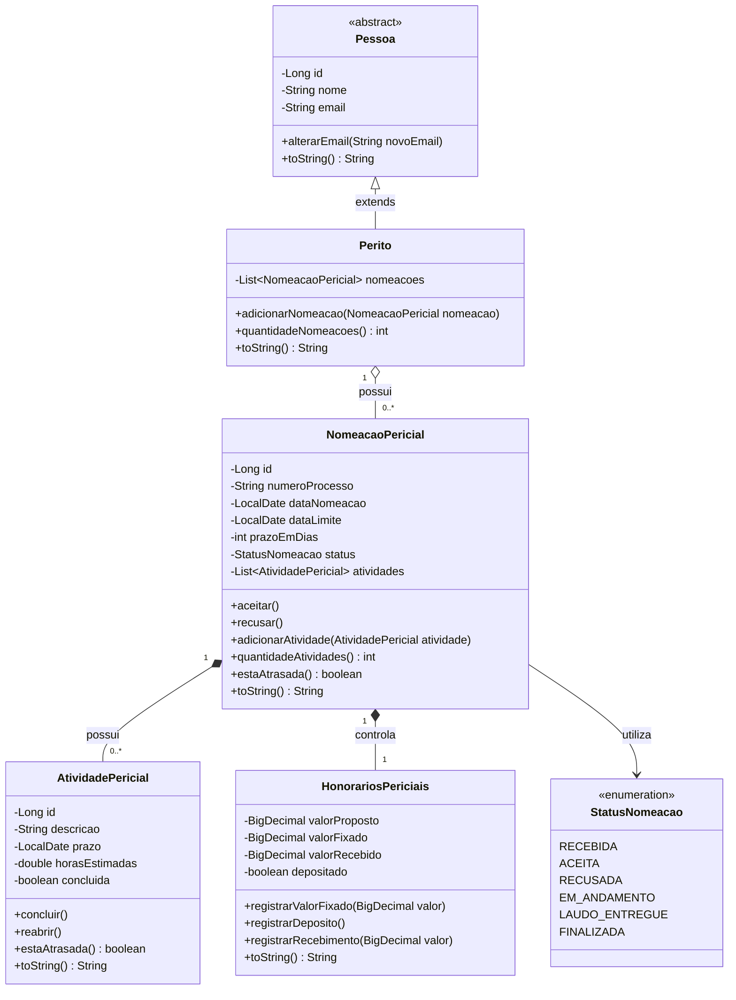
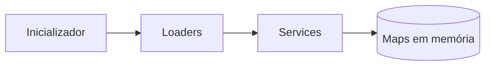

# André Gaspar API

Aplicação acadêmica desenvolvida com Java e Spring Boot para auxiliar no
controle do ciclo de vida das nomeações recebidas por peritos judiciais.

Todos os dados utilizados nesta aplicação são fictícios e destinados
exclusivamente à demonstração acadêmica.

## Etapa atual

Etapa 2 — Estruturas de Dados e Camada de Serviço.

Nesta etapa, os dados fictícios são lidos dos arquivos-texto, relacionados
pelos Loaders e armazenados em memória pelos Services, utilizando
`Map<Long, Objeto>`. A aplicação também demonstra operações CRUD,
Generics, lambdas e Streams.

Ainda não existem API REST, Controllers, persistência com JPA ou banco de
dados. Esses recursos serão introduzidos nas etapas seguintes.

## Tecnologias

- Java 21
- Java Collections Framework
- Lambdas e Streams
- Spring Boot 4.1.1
- Maven
- JUnit
- Git

## Modelo de negócio

O modelo possui as seguintes classes principais:

- `Pessoa`: classe abstrata com os dados comuns de uma pessoa;
- `Perito`: representa o perito que recebe nomeações;
- `NomeacaoPericial`: representa uma nomeação recebida em um processo;
- `AtividadePericial`: representa uma atividade vinculada à nomeação;
- `HonorariosPericiais`: representa os valores dos honorários.

Também existe o enum `StatusNomeacao`, que limita os estados possíveis
de uma nomeação pericial.

## Diagrama de classes do domínio



## Herança e abstração

A classe `Pessoa` é abstrata. A classe `Perito` herda seus atributos e
comportamentos:

```java
public class Perito extends Pessoa
```

## Relacionamentos um-para-muitos

Um perito pode possuir várias nomeações:

```java
private List<NomeacaoPericial> nomeacoes;
```

Uma nomeação pode possuir várias atividades:

```java
private List<AtividadePericial> atividades;
```

Nesta etapa, os relacionamentos são representados por coleções Java em
memória. As anotações JPA serão introduzidas somente na etapa de
persistência.

## Arquitetura da Etapa 2

A aplicação utiliza armazenamento temporário em memória. Os Loaders leem
os arquivos-texto e encaminham os objetos para a camada de serviço, que
encapsula os Maps.



O fluxo de carga é:

- `PeritoLoader` → `PeritoService` → `Map<Long, Perito>`;
- `NomeacaoLoader` → `NomeacaoPericialService` →
  `Map<Long, NomeacaoPericial>`;
- `AtividadeLoader` → `AtividadePericialService` →
  `Map<Long, AtividadePericial>`.

## Camada de serviço

A interface genérica:

```java
CrudService<T, ID>
```

define as operações comuns:

- `incluir(T objeto)`;
- `alterar(T objeto)`;
- `excluir(ID id)`;
- `obterPorId(ID id)`;
- `listarTodos()`.

As implementações são:

- `PeritoService`;
- `NomeacaoPericialService`;
- `AtividadePericialService`.

Cada Service mantém seu próprio `LinkedHashMap`, utilizando o identificador
do objeto como chave e o próprio objeto como valor. O armazenamento fica
encapsulado e somente pode ser manipulado pelas operações da camada de
serviço.

## Consultas com lambdas e Streams

O `NomeacaoPericialService` possui consultas coerentes com o domínio:

- `listarPorStatus()`: filtra nomeações pelo status;
- `listarOrdenadasPorPrazo()`: ordena nomeações pela data-limite;
- `obterPorNumeroProcesso()`: busca uma nomeação pelo número do processo;
- `listarNumerosProcessos()`: transforma objetos em uma lista de números
  processuais.

Essas operações demonstram o uso de `filter`, `sorted`, `findFirst`, `map`,
lambdas e referências de métodos.

## Tratamento de exceções

A camada de serviço utiliza exceções específicas:

- `DadosInvalidosException`: informa o fornecimento de dados inválidos;
- `EntidadeJaExistenteException`: impede a inclusão de identificadores
  duplicados;
- `EntidadeNaoEncontradaException`: informa tentativas de recuperar,
  alterar ou excluir objetos inexistentes.


## Tipos de atributos

O modelo utiliza diferentes tipos de informação:

- texto: `String`;
- número inteiro: `int`;
- número real: `double`;
- valor lógico: `boolean`;
- data: `LocalDate`;
- valor monetário: `BigDecimal`.

As classes de domínio implementam o método `toString()` para fornecer
uma representação textual dos objetos.

## Leitura dos arquivos-texto

Os dados fictícios estão armazenados em:

```text
src/main/resources/dados/peritos.txt
src/main/resources/dados/nomeacoes.txt
src/main/resources/dados/atividades.txt
```

A leitura é realizada pelas seguintes classes:

- `PeritoLoader`;
- `NomeacaoLoader`;
- `AtividadeLoader`.

O arquivo `nomeacoes.txt` possui o campo `peritoId`, enquanto
`atividades.txt` possui o campo `nomeacaoId`. Esses identificadores permitem
estabelecer os relacionamentos um-para-muitos durante a carga.

Os Loaders criam os objetos, recuperam seus objetos relacionados pelos
Services e estabelecem as associações. Em seguida, cada objeto é incluído
no `Map` do respectivo Service.

## Inicialização e teste do modelo

A classe `InicializadorAplicacao` implementa `CommandLineRunner`.

Durante a inicialização, a aplicação:

1. cria os três Services e seus Maps;
2. lê os arquivos-texto;
3. cria os objetos;
4. associa as nomeações ao perito;
5. associa as atividades às nomeações;
6. inclui os objetos nos respectivos Services;
7. recupera os dados armazenados em memória;
8. executa consultas com Streams;
9. apresenta os objetos e o resumo no console.

## Como testar

No Linux ou WSL:

```bash
./mvnw clean test
```

Resultado esperado:

```text
Tests run: 6, Failures: 0, Errors: 0
BUILD SUCCESS
```

Os testes validam:

- inicialização do contexto Spring Boot;
- operações CRUD do serviço de nomeações;
- tratamento de duplicidade e entidade inexistente;
- consultas com Streams;
- leitura dos três arquivos-texto;
- armazenamento nos Services;
- relacionamentos um-para-muitos.

## Como executar

Para executar como aplicação de console:

```bash
./mvnw spring-boot:run \
  -Dspring-boot.run.arguments=--spring.main.web-application-type=none
```

Resumo esperado:

```text
Peritos carregados: 1
Nomeacoes carregadas: 2
Atividades carregadas: 4
```

## Limites da Etapa 2

Nesta etapa, ainda não foram implementados:

- API REST;
- Controllers;
- DTOs;
- persistência com JPA;
- Repositories;
- banco de dados.

O armazenamento atual com `Map` é temporário e será substituído pelo
Spring Data JPA na Etapa 4.

## Evolução planejada

- Etapa 1: orientação a objetos e arquivos-texto — concluída;
- Etapa 2: Collections, Map e camada de serviço — etapa atual;
- Etapa 3: API REST com Spring Boot;
- Etapa 4: persistência com Spring Data JPA.

## Marco da etapa

A conclusão desta versão será registrada com a tag Git:

```text
etapa-2
```

## Uso de inteligência artificial

Ferramentas de inteligência artificial foram utilizadas como apoio ao
planejamento, esclarecimento de dúvidas, configuração, documentação e
revisão da qualidade. A implementação foi acompanhada, executada e
compreendida pelo aluno, responsável pela validação do projeto.
