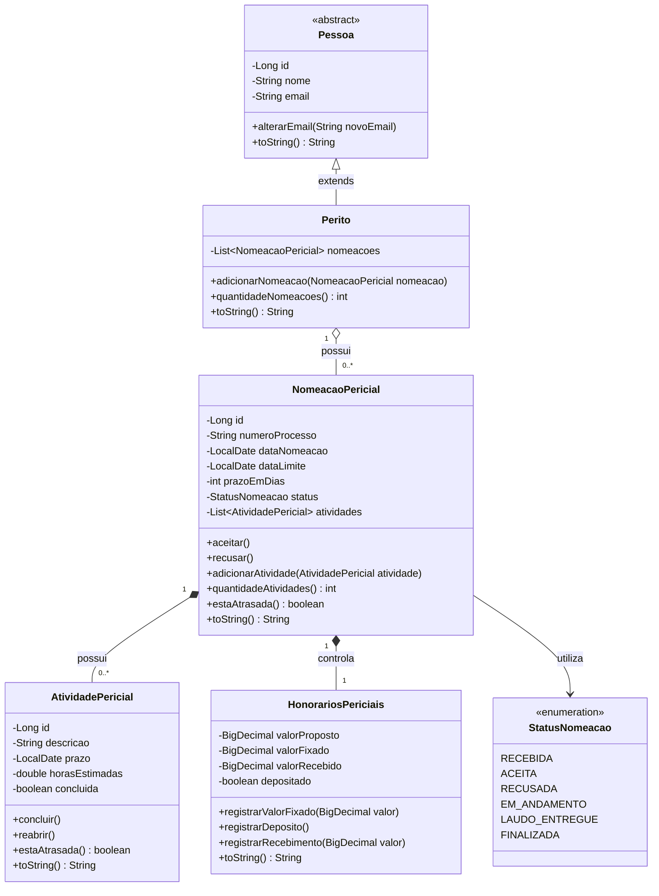
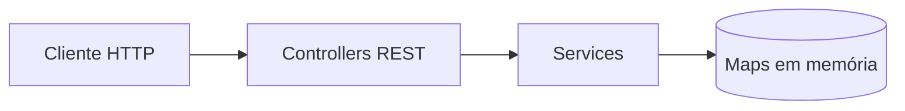

# André Gaspar API

Aplicação acadêmica desenvolvida com Java e Spring Boot para auxiliar no
controle do ciclo de vida das nomeações recebidas por peritos judiciais.

Todos os dados utilizados nesta aplicação são fictícios e destinados
exclusivamente à demonstração acadêmica.

## Etapa atual

Etapa 3 — API REST com Spring Boot.

Nesta etapa, as funcionalidades da aplicação são disponibilizadas por
endpoints REST organizados na arquitetura Controller → Service → Map.
Os Controllers utilizam injeção de dependência por construtor e delegam
as operações para a camada de serviço.

A API possui operações HTTP de inclusão, alteração, exclusão, listagem e
obtenção por identificador para peritos, nomeações e atividades periciais.
As respostas utilizam códigos HTTP adequados e tratamento global de
exceções.

Os endpoints podem ser testados e visualizados por meio do Swagger UI.
Os dados ainda permanecem temporariamente armazenados em memória com
`Map`. A persistência com Spring Data JPA e banco de dados será
introduzida somente na Etapa 4.

## Tecnologias

- Java 21
- Java Collections Framework
- Lambdas e Streams
- Spring Boot 4.1.1
- Spring MVC
- Springdoc OpenAPI
- Swagger UI
- Postman
- MockMvc
- Maven
- JUnit
- Git

## Modelo de negócio

O modelo possui as seguintes classes principais:

- `Pessoa`: classe abstrata com os dados comuns de uma pessoa;
- `Perito`: representa o perito que recebe nomeações;
- `NomeacaoPericial`: representa uma nomeação recebida em um processo;
- `AtividadePericial`: representa uma atividade vinculada à nomeação;
- `HonorariosPericiais`: representa os valores dos honorários.

Também existe o enum `StatusNomeacao`, que limita os estados possíveis
de uma nomeação pericial.

## Diagrama de classes do domínio



## Herança e abstração

A classe `Pessoa` é abstrata. A classe `Perito` herda seus atributos e
comportamentos:

```java
public class Perito extends Pessoa
```

## Relacionamentos um-para-muitos

Um perito pode possuir várias nomeações:

```java
private List<NomeacaoPericial> nomeacoes;
```

Uma nomeação pode possuir várias atividades:

```java
private List<AtividadePericial> atividades;
```

Nesta etapa, os relacionamentos são representados por coleções Java em
memória. As anotações JPA serão introduzidas somente na etapa de
persistência.

## Arquitetura da Etapa 3

A aplicação utiliza a separação de responsabilidades esperada para a
Etapa 3. Os clientes HTTP comunicam-se com os Controllers, que delegam
as operações aos Services. Os Services encapsulam o armazenamento
temporário nos Maps.



Os Loaders continuam responsáveis pela carga inicial dos arquivos-texto.
As mesmas instâncias dos Services são compartilhadas pelos Loaders e
Controllers através da injeção de dependência do Spring.

O fluxo principal da API é:

- cliente HTTP → `PeritoController` → `PeritoService` →
  `Map<Long, Perito>`;
- cliente HTTP → `NomeacaoPericialController` →
  `NomeacaoPericialService` → `Map<Long, NomeacaoPericial>`;
- cliente HTTP → `AtividadePericialController` →
  `AtividadePericialService` → `Map<Long, AtividadePericial>`.

Essa arquitetura ainda não utiliza Repository, JPA ou banco de dados.

## Camada de serviço

A interface genérica:

```java
CrudService<T, ID>
```

define o contrato das operações comuns:

- `incluir(T objeto)`;
- `alterar(T objeto)`;
- `excluir(ID id)`;
- `obterPorId(ID id)`;
- `listarTodos()`.

A interface `Identificavel` estabelece que os objetos gerenciados pela
camada de serviço devem disponibilizar seu identificador por meio do método
`getId()`.

A classe abstrata genérica:

```java
BaseCrudService<T extends Identificavel>
```

implementa o contrato `CrudService<T, Long>` e centraliza:

- o armazenamento em `LinkedHashMap<Long, T>`;
- as operações CRUD;
- a validação comum dos identificadores;
- o tratamento de duplicidade e de entidades inexistentes.

Os Services específicos herdam essa implementação:

- `PeritoService extends BaseCrudService<Perito>`;
- `NomeacaoPericialService extends BaseCrudService<NomeacaoPericial>`;
- `AtividadePericialService extends BaseCrudService<AtividadePericial>`.

Cada instância de Service possui seu próprio Map herdado, enquanto as
classes específicas mantêm somente as validações e consultas relacionadas
ao respectivo domínio. Essa organização reduz a duplicação do CRUD e
demonstra o uso combinado de interfaces, herança, abstração e Generics.

## Consultas com lambdas e Streams

O `NomeacaoPericialService` possui consultas coerentes com o domínio:

- `listarPorStatus()`: filtra nomeações pelo status;
- `listarOrdenadasPorPrazo()`: ordena nomeações pela data-limite;
- `obterPorNumeroProcesso()`: busca uma nomeação pelo número do processo;
- `listarNumerosProcessos()`: transforma objetos em uma lista de números
  processuais.

Essas operações demonstram o uso de `filter`, `sorted`, `findFirst`, `map`,
lambdas e referências de métodos.

## Tratamento de exceções

A camada de serviço utiliza exceções específicas:

- `DadosInvalidosException`: informa o fornecimento de dados inválidos;
- `EntidadeJaExistenteException`: impede a inclusão de identificadores
  duplicados;
- `EntidadeNaoEncontradaException`: informa tentativas de recuperar,
  alterar ou excluir objetos inexistentes.

## Endpoints REST

A aplicação disponibiliza operações CRUD para os três principais
contextos de negócio:

| Método | Peritos | Nomeações | Atividades |
| --- | --- | --- | --- |
| GET | `/api/peritos` | `/api/nomeacoes` | `/api/atividades` |
| GET por ID | `/api/peritos/{id}` | `/api/nomeacoes/{id}` | `/api/atividades/{id}` |
| POST | `/api/peritos` | `/api/nomeacoes` | `/api/atividades` |
| PUT | `/api/peritos/{id}` | `/api/nomeacoes/{id}` | `/api/atividades/{id}` |
| DELETE | `/api/peritos/{id}` | `/api/nomeacoes/{id}` | `/api/atividades/{id}` |

Os Controllers recebem as requisições HTTP e delegam as operações aos
respectivos Services por meio de injeção de dependência por construtor.
As regras e o armazenamento não ficam implementados nos Controllers.

## Respostas HTTP

A API utiliza os seguintes códigos:

- `200 OK`: consulta ou alteração realizada com sucesso;
- `201 Created`: objeto incluído com sucesso;
- `204 No Content`: objeto excluído com sucesso;
- `400 Bad Request`: identificador ou dados inválidos;
- `404 Not Found`: objeto não encontrado;
- `409 Conflict`: tentativa de incluir um identificador já existente.

A classe `TratadorGlobalExcecoes`, anotada com
`@RestControllerAdvice`, converte as exceções da aplicação em respostas
HTTP padronizadas. O corpo dos erros é representado por `ErroApi`, contendo
data e hora, status, erro, mensagem e caminho da requisição.

## Documentação OpenAPI e Swagger

Os principais endpoints são documentados com OpenAPI por meio do
Springdoc. Os Controllers utilizam anotações como `@Tag`, `@Operation`,
`@Parameter`, `@ApiResponse` e `@ApiResponses` para descrever os recursos,
as operações, os parâmetros e os códigos de resposta.

A configuração geral da documentação é definida pela classe
`OpenApiConfig`. A interface Swagger UI permite visualizar a documentação,
informar parâmetros, enviar requisições HTTP e conferir os dados retornados
pela API diretamente no navegador.

A documentação pode ser acessada em:

- Swagger UI: `http://localhost:8080/swagger-ui/index.html`;
- especificação OpenAPI: `http://localhost:8080/v3/api-docs`.

O Swagger UI também foi utilizado como cliente HTTP interativo para
demonstrar e testar os endpoints da aplicação.

## Tipos de atributos

O modelo utiliza diferentes tipos de informação:

- texto: `String`;
- número inteiro: `int`;
- número real: `double`;
- valor lógico: `boolean`;
- data: `LocalDate`;
- valor monetário: `BigDecimal`.

As classes de domínio implementam o método `toString()` para fornecer
uma representação textual dos objetos.

## Leitura dos arquivos-texto

Os dados fictícios estão armazenados em:

```text
src/main/resources/dados/peritos.txt
src/main/resources/dados/nomeacoes.txt
src/main/resources/dados/atividades.txt
```

A leitura é realizada pelas seguintes classes:

- `PeritoLoader`;
- `NomeacaoLoader`;
- `AtividadeLoader`.

O arquivo `nomeacoes.txt` possui o campo `peritoId`, enquanto
`atividades.txt` possui o campo `nomeacaoId`. Esses identificadores permitem
estabelecer os relacionamentos um-para-muitos durante a carga.

Os Loaders criam os objetos, recuperam seus objetos relacionados pelos
Services e estabelecem as associações. Em seguida, cada objeto é incluído
no `Map` do respectivo Service.

## Inicialização e testes

A classe `InicializadorAplicacao` implementa `CommandLineRunner`.

Durante a inicialização, a aplicação:

1. recebe os três Services por injeção de dependência;
2. lê os arquivos-texto;
3. cria os objetos;
4. associa as nomeações ao perito;
5. associa as atividades às nomeações;
6. inclui os objetos nos respectivos Services;
7. disponibiliza os mesmos dados aos Controllers;
8. executa consultas com Streams;
9. apresenta os objetos e o resumo no console.

## Como testar

No Linux ou WSL:

```bash
./mvnw clean test
```

Resultado esperado:

```text
Tests run: 10, Failures: 0, Errors: 0, Skipped: 0
BUILD SUCCESS
```

Os testes validam:

- inicialização do contexto Spring Boot;
- operações CRUD da camada de serviço;
- carga dos três arquivos-texto;
- relacionamentos um-para-muitos;
- consultas com Streams;
- endpoints dos três contextos de negócio;
- ciclo REST de inclusão, alteração, consulta e exclusão;
- códigos HTTP de sucesso e de erro;
- estrutura padronizada das respostas de erro;
- geração e conteúdo da documentação OpenAPI.

### Testes com Postman

Os endpoints também foram testados por meio de uma coleção do Postman,
organizada por recursos e cenários de erro:

- `Peritos`: listagem e obtenção por identificador;
- `Nomeações`: listagem dos registros;
- `Atividades`: listagem, inclusão, alteração e exclusão;
- `Erros`: validação dos retornos `400`, `404` e `409`.

A execução completa da coleção contempla dez requisições e 29 testes
automatizados, com validação dos códigos HTTP, do formato JSON e do
conteúdo das respostas.

A coleção pode ser importada no Postman por meio do arquivo
`postman/Andre-Gaspar-API-Etapa-3.postman_collection.json`.

Para executá-la:

1. iniciar a aplicação com `./mvnw spring-boot:run`;
2. importar a coleção no Postman;
3. confirmar que a variável `baseUrl` contém
   `http://localhost:8080`;
4. executar a coleção pelo Collection Runner com uma iteração.

## Como executar

Para iniciar a API REST:

```bash
./mvnw spring-boot:run
```

Com a aplicação em execução, podem ser acessados:

- Swagger UI: `http://localhost:8080/swagger-ui/index.html`;
- OpenAPI JSON: `http://localhost:8080/v3/api-docs`;
- peritos: `http://localhost:8080/api/peritos`;
- nomeações: `http://localhost:8080/api/nomeacoes`;
- atividades: `http://localhost:8080/api/atividades`.

Resumo esperado da carga inicial:

```text
Peritos carregados: 1
Nomeacoes carregadas: 2
Atividades carregadas: 4
```

## Limites da Etapa 3

Nesta etapa, ainda não foram implementados:

- persistência com JPA;
- Repositories;
- banco de dados.

O armazenamento atual com `Map` é temporário e será substituído pelo
Spring Data JPA na Etapa 4.

## Evolução planejada

- Etapa 1: orientação a objetos e arquivos-texto — concluída;
- Etapa 2: Collections, Map e camada de serviço — concluída;
- Etapa 3: API REST com Spring Boot — etapa atual;
- Etapa 4: persistência com Spring Data JPA.

## Marco da etapa

A conclusão desta versão será registrada com a tag Git:

```text
etapa-3
```

## Uso de inteligência artificial

O ChatGPT, da OpenAI, foi utilizado como ferramenta de apoio ao
planejamento, ao esclarecimento de dúvidas, à configuração do framework,
à depuração, à documentação e à revisão da qualidade do código. A
modelagem, a implementação, a execução e a validação da aplicação foram
acompanhadas e compreendidas pelo aluno, responsável pelo resultado final.
